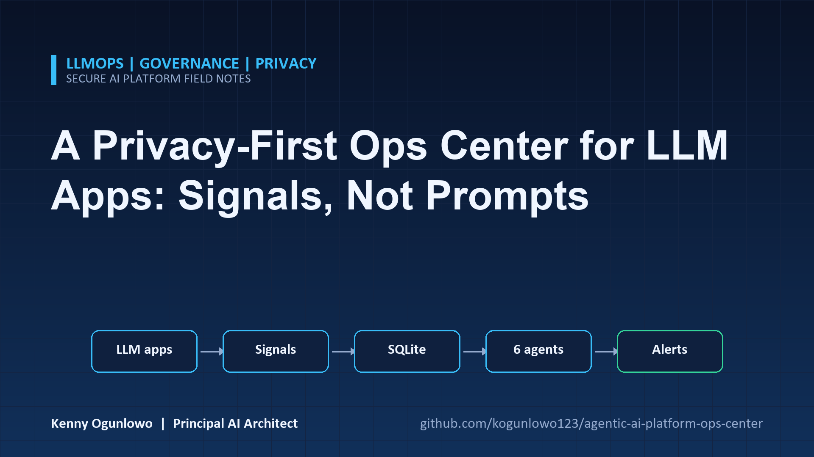
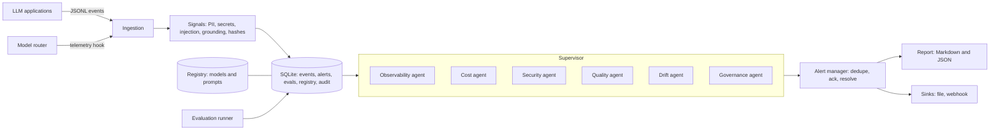
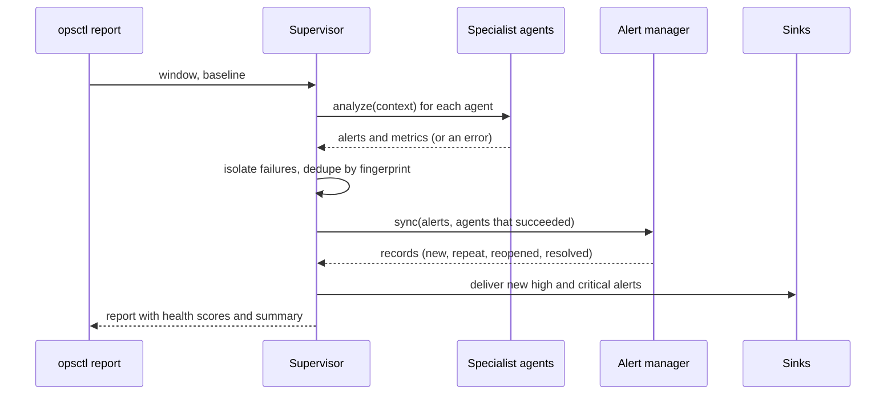

# Agentic AI Platform Operations Center



A control plane for teams running LLM applications. Applications report one small event per model
call. A supervisor agent coordinates six specialist agents (observability, cost, security, quality,
drift and governance) over that telemetry, turns their findings into ranked alerts with a full
lifecycle (open, acknowledged, resolved), and produces a platform health report. It also ships a model
and prompt registry with approval workflows, an evaluation runner with regression tracking, and a
multi-model router with circuit breakers.

Privacy is a design constraint, not an afterthought: prompts and responses are read once at ingestion
to compute signals (PII and credential counts, injection matches, answer grounding) and are then
discarded. The database holds metrics and signals, never raw text or user ids.

## Table of contents

- [Project overview](#project-overview)
- [Architecture](#architecture)
- [Features](#features)
- [Repository structure](#repository-structure)
- [Installation](#installation)
- [Quick start](#quick-start)
- [Detailed usage](#detailed-usage)
- [Telemetry format](#telemetry-format)
- [Configuration](#configuration)
- [Security and privacy](#security-and-privacy)
- [Testing](#testing)
- [CI/CD](#cicd)
- [Limitations](#limitations)
- [Roadmap](#roadmap)
- [Contributing](#contributing)
- [License](#license)

## Project overview

### What it is

A Python library and CLI (`opsctl`) that answers the questions platform teams get asked about LLM
applications: Are they up and fast enough? What are they costing and why did spend jump? Are they leaking
data or being attacked? Are answers still grounded? Has traffic or behaviour drifted? Are we only using
models and prompts that were approved?

### Why it exists

LLM applications fail in ways ordinary APM does not cover: cost that scales with prompt size, answers that
degrade silently, injection attempts, personal data in responses, and model or prompt changes that
bypass review. Teams end up with a dashboard per concern and no single view of platform risk. This
project puts those concerns behind one telemetry format and one alert lifecycle.

### Who should use it

- Platform and LLMOps teams operating several LLM applications.
- Security and governance teams that need evidence of what models and prompts are in production.
- Engineering leaders who want cost, quality and risk in one report.

### Business value

| Outcome | Mechanism |
| ------- | --------- |
| Catch cost surprises early | Budget, projection and spike alerts; quantified caching and model-downshift opportunities |
| Catch quality decay | Grounding monitoring, evaluation regressions, drift detection |
| Reduce data exposure | PII and credential detection in outputs, injection-rate and repeat-offender alerts |
| Enforce governance | Production traffic checked against the model and prompt registry; separation of duties on approvals; audit log |
| Keep alerts actionable | Deduplication, acknowledgement, auto-resolution, health scores per application |
| Stay privacy-preserving | Text is reduced to signals at ingestion; users are stored as salted hashes |

## Architecture

### System architecture



### Agent architecture

| Agent | Responsibility |
| ----- | -------------- |
| **Supervisor** | Runs the specialists against one window and its baseline, isolates their failures, deduplicates alerts, syncs the alert lifecycle, delivers new high-severity alerts and computes health scores. |
| **Observability** | Request volume, error rate, p50/p95/p99 latency per application and model; error-budget burn against the SLO; latency SLO breaches; error spikes versus baseline. |
| **Cost** | Spend by application, model and prompt; unpriced usage; daily and projected monthly budgets; spend spikes; caching and model-downshift opportunities with estimated savings. |
| **Security** | Credentials and PII in outputs; prompt-injection rate; repeat offenders by user hash. |
| **Quality** | Answer grounding (a hallucination-risk proxy) on retrieval traffic; evaluation regressions; stale evaluation suites. |
| **Drift** | PSI and Kolmogorov-Smirnov tests on input size, output size, latency, tokens, cost and grounding; PSI on model mix and prompt version mix. |
| **Governance** | Production calls to unregistered, proposed, deprecated or blocked models; use of draft, in-review, deprecated or unregistered prompts; overdue model reviews. |

The specialists are deterministic, rule-based analysers, so results are reproducible and testable. No
model is called during analysis. Models are used only by the evaluation runner and the router.

### Execution flow



An agent that raises does not stop the run. Its error appears in the report and as a high-severity
alert, and its existing alerts are left untouched rather than silently resolved.

### Health scoring

Each open alert deducts weight (critical 30, high 15, medium 6, low 2, info 0). An application's health
is `100 * exp(-penalty / 60)`, so scores stay ordered when problems pile up. Acknowledged and resolved
alerts do not count. Platform-level alerts scale the overall score.

Design details and trade-offs are in [docs/architecture.md](docs/architecture.md), with decision
records in [docs/adr](docs/adr).

## Features

- **Telemetry ingestion** with strict validation, bounded sizes, duplicate handling and per-line error
  reports that never echo content.
- **Signals at ingestion**: PII (emails, phones, SSN-shaped values, Luhn-valid cards), credentials,
  injection patterns, lexical answer grounding, salted input hashes for duplicate detection.
- **Six specialist agents** and a supervisor with failure isolation.
- **Alert lifecycle**: stable fingerprints, occurrence counts, acknowledgement, auto-resolution, reopen.
- **Model and prompt registry** with allowed transitions, separation of duties (owners cannot approve
  their own models, authors cannot approve their own prompts), hash-pinned prompts and an audit log.
- **Evaluation suites** of deterministic assertions, stored runs and case-level regression tracking.
- **Multi-model router**: cost, latency, quality or ordered strategies, tiers, fallback, per-model
  circuit breakers with half-open trials, and telemetry emitted for every attempt.
- **Synthetic telemetry** with a realistic incident for demos and tests.
- **Reports** in Markdown and JSON, with CI gating through `--fail-on`.
- **Alert delivery** to JSON Lines files or webhooks, with secrets redacted.

## Repository structure

```
agentic-ai-platform-ops-center/
├── .github/
│   ├── dependabot.yml
│   └── workflows/
│       ├── ci.yml                    # lint, format, types, tests, audit, build
│       └── codeql.yml
├── configs/
│   ├── apps.example.yaml             # SLOs and budgets per application
│   ├── pricing.example.json          # illustrative model prices
│   ├── registry.example.yaml         # bootstrap models and prompts
│   └── evals/support-regression.yaml # sample evaluation suite
├── docs/
│   ├── architecture.md
│   └── adr/
├── src/opscenter/
│   ├── agents/
│   │   ├── base.py                   # analysis context and alert helper
│   │   ├── observability.py
│   │   ├── cost.py
│   │   ├── security_agent.py
│   │   ├── quality.py
│   │   ├── drift.py
│   │   ├── governance.py
│   │   └── supervisor.py             # orchestration, isolation, health
│   ├── providers/                    # HTTP client and chat clients
│   ├── alerts.py                     # lifecycle and sinks
│   ├── cli.py                        # opsctl
│   ├── config.py                     # settings, SLOs, thresholds
│   ├── container.py                  # composition root
│   ├── db.py                         # SQLite schema
│   ├── evals.py                      # suites, runs, regressions
│   ├── models.py
│   ├── pricing.py
│   ├── registry.py                   # lifecycle rules and audit log
│   ├── reporting.py
│   ├── router.py                     # multi-model routing and breakers
│   ├── security.py                   # PII, secrets, injection, hashing
│   ├── service.py
│   ├── signals.py                    # signals derived at ingestion
│   ├── simulate.py                   # synthetic telemetry
│   ├── stats.py                      # percentiles, PSI, KS
│   ├── store.py                      # event store
│   └── telemetry.py                  # ingestion
├── tests/
│   ├── unit/
│   └── integration/
├── .env.example
├── CHANGELOG.md
├── CONTRIBUTING.md
├── Dockerfile
├── LICENSE
├── Makefile
├── SECURITY.md
├── pyproject.toml
├── requirements.txt
└── requirements-dev.txt
```

## Installation

Requirements: Python 3.10 or newer.

```bash
git clone <repository-url>
cd agentic-ai-platform-ops-center
python -m venv .venv
source .venv/bin/activate            # Windows: .venv\Scripts\activate
python -m pip install -e ".[dev]"
```

## Quick start

The repository includes a generator for synthetic telemetry that ends with a realistic incident, so you
can see every agent work without any real traffic.

```bash
export OPSCENTER_DB_PATH=.opscenter/demo.db
export OPSCENTER_PRICING_FILE=configs/pricing.example.json
export OPSCENTER_APPS_FILE=configs/apps.example.yaml
export OPSCENTER_HASH_SALT=change-me

opsctl simulate --out demo.jsonl
opsctl ingest demo.jsonl
opsctl registry import configs/registry.example.yaml
opsctl report --out ops-report --fail-on critical
```

```
wrote 5601 events to demo.jsonl
{"lines": 5601, "accepted": 5601, "duplicates": 0, "rejected": 0, "unpriced": 6, "errors": []}
imported 3 models and 2 prompt versions
Analysed 801 events across 2 applications. Platform health 28/100 with 22 open alerts (1 critical, 15 high, 4 medium, 1 low, 1 info). Weakest application: support-bot (2/100). Top issues: Credential-shaped data in model output [support-bot]; Production traffic on unregistered model experimental-model [code-assistant]; Production uses in_review prompt code-review@1 [code-assistant].
```

The command exits 1 because a critical alert is open. The simulated final day contains slower and
failing responses, a shift to the more expensive model with larger prompts, falling grounding,
injection attempts from a few users, PII and a credential in outputs, and an unregistered model.

```bash
opsctl alerts list --status open
```

```
27f313d7a5df5de0  open     critical support-bot      Credential-shaped data in model output
085bf9135511bfbb  open     high     support-bot      Drift in input_tokens
1869e27f5e546b1e  open     high     support-bot      PII in model output
24e146db76815aac  open     high     support-bot      Drift in model
...
```

`ops-report/ops-report.md` contains evidence and a recommendation for every alert plus tables for
latency, cost, drift, governance and quality. The simulated data is synthetic, so treat these numbers as
a demonstration of the mechanics rather than a benchmark.

## Detailed usage

### 1. Send telemetry

Applications write one JSON object per LLM call to a JSON Lines file (or you build events with
`LLMEvent` and call `service.ingest_events`). See [Telemetry format](#telemetry-format).

```bash
opsctl ingest events.jsonl
```

The output reports accepted, duplicate and rejected lines. Errors name the line and the problem but
never include the line's content.

### 2. Analyse a window

```bash
opsctl report --window 24h --baseline 6d --out ops-report
opsctl report --now 2026-09-19T12:00:00Z          # analyse as of a specific time
opsctl report --fail-on high                        # exit 1 while a high or critical alert is open
```

The baseline is the period immediately before the window. `--fail-on` counts only open alerts:
acknowledged and resolved alerts do not fail the gate.

### 3. Work the alerts

```bash
opsctl alerts list --status open
opsctl alerts ack 27f313d7 --actor oncall       # accepts a fingerprint prefix
```

An acknowledged alert stays acknowledged while it keeps firing and resolves when it stops. A resolved
alert that returns reopens and is delivered again.

### 4. Govern models and prompts

```bash
opsctl registry add-model gpt-x --actor alice --owner alice --review-due 2026-12-31
opsctl registry set-model gpt-x approved --actor bob      # alice cannot approve her own model
opsctl registry add-prompt support-answer 4 --file prompt.txt --author alice
opsctl registry set-prompt support-answer 4 in_review --actor alice
opsctl registry set-prompt support-answer 4 approved --actor bob
opsctl registry list
opsctl registry audit
```

Model statuses move `proposed -> approved -> deprecated`. `blocked` is reachable from every other status,
and a blocked model can only return to `proposed`. Prompt versions move `draft -> in_review -> approved -> deprecated`. Only a hash of prompt
content is stored, so `registry.verify_prompt(id, version, text)` can confirm production runs the approved
text without the registry holding it.

### 5. Evaluate models

Suites are YAML files of cases with deterministic assertions (`contains`, `not_contains`,
`contains_any`, `equals`, `regex`, `max_chars`, `min_chars`, `json_valid`, `json_has_keys`, `no_pii`,
`no_secrets`). See `configs/evals/support-regression.yaml`.

```bash
export OPSCENTER_LLM_PROVIDER=anthropic          # or openai
export OPSCENTER_ANTHROPIC_API_KEY=...
opsctl eval run configs/evals/support-regression.yaml --target claude-sonnet-5
opsctl eval history support-regression
```

Each run is stored. The quality agent compares the two latest runs of a suite and target, and raises a
high-severity alert when the pass rate falls by the configured amount, naming the newly failing cases.
`eval run` exits 1 when the pass rate is below the suite's threshold.

### 6. Route across models

```python
from opscenter import build_service, Settings
from opscenter.router import ModelRouter, RouteCandidate

service = build_service(Settings())
router = ModelRouter(
    [
        RouteCandidate(
            "small-model", small_client, tier="fast", input_per_mtok=0.5, output_per_mtok=1.5
        ),
        RouteCandidate(
            "large-model",
            large_client,
            tier="smart",
            quality=90,
            input_per_mtok=3.0,
            output_per_mtok=15.0,
        ),
    ],
    strategy="cost",
    failure_threshold=3,
    cooldown_seconds=30,
    app="support-bot",
    on_event=service.store_event,  # every attempt becomes telemetry
)
result = router.complete("You are concise.", "Summarise this ticket.", tier="fast")
print(result.text, result.model, [a.outcome for a in result.attempts])
```

A model that fails `failure_threshold` times in a row is skipped for `cooldown_seconds`, then given a
single trial request. `router.state()` exposes breaker state and observed latency. Token counts in the
emitted telemetry are estimates (four characters per token) because the chat client interface returns
only text.

### 7. Deliver alerts

```bash
export OPSCENTER_WEBHOOK_URL=https://hooks.example.com/services/...
```

New and reopened high and critical alerts are posted once. Payloads contain the severity, application,
title, detail and recommendation with secrets redacted, and the URL is treated as a secret. For file
delivery, pass `FileSink` to `build_service(sinks=[...])`.

### 8. Python API

```python
from datetime import timedelta
from pathlib import Path

from opscenter import Settings, build_service

with build_service(Settings()) as service:
    service.ingest_file(Path("events.jsonl"))
    report = service.report(window=timedelta(hours=24), baseline=timedelta(days=6))
    print(report.summary)
    for alert in report.open_alerts():
        print(alert.severity.value, alert.app, alert.title)
```

## Telemetry format

One JSON object per line. Unknown fields are ignored.

```json
{
  "event_id": "req-8f3a",
  "timestamp": "2026-09-19T10:15:00Z",
  "app": "support-bot",
  "environment": "prod",
  "model": "large-model",
  "provider": "example",
  "prompt_id": "support-answer",
  "prompt_version": "3",
  "input_tokens": 812,
  "output_tokens": 164,
  "latency_ms": 1934.5,
  "status": "ok",
  "user_id": "user-1042",
  "input_text": "When do backups run?",
  "output_text": "Backups run every night at 02:00 UTC.",
  "context": ["Acme Cloud backups run every night at 02:00 UTC."],
  "cost_usd": 0.0041,
  "tags": {"region": "eu"}
}
```

Required: `timestamp`, `app`, `model`. `status` is `ok`, `error`, `timeout` or `blocked`. Text fields
(`input_text`, `output_text`, `context`) and `user_id` are optional and are consumed at ingestion. If
`cost_usd` is absent it is computed from the price catalog, and models missing from the catalog are
reported as unpriced usage.

## Configuration

Read from `OPSCENTER_*` environment variables and an optional `.env` file. See [.env.example](.env.example).

| Variable | Default | Purpose |
| -------- | ------- | ------- |
| `OPSCENTER_DB_PATH` | `.opscenter/opscenter.db` | SQLite database |
| `OPSCENTER_PRICING_FILE` | unset | JSON price catalog (see `configs/pricing.example.json`) |
| `OPSCENTER_APPS_FILE` | unset | YAML with per-application SLOs and budgets |
| `OPSCENTER_HASH_SALT` | empty | Secret salt for user and input hashes; set this |
| `OPSCENTER_MAX_LINE_BYTES` / `_MAX_LINES` | `200000` / `2000000` | Ingestion limits |
| `OPSCENTER_THRESHOLDS` | defaults | JSON object overriding analysis thresholds |
| `OPSCENTER_LLM_PROVIDER` | `none` | `none`, `openai` or `anthropic` (evaluations only) |
| `OPSCENTER_OPENAI_API_KEY` / `OPSCENTER_ANTHROPIC_API_KEY` | unset | Also accept vendor-standard names |
| `OPSCENTER_OPENAI_CHAT_MODEL` / `OPSCENTER_ANTHROPIC_MODEL` | `gpt-4o-mini` / `claude-sonnet-5` | Model for evaluations |
| `OPSCENTER_WEBHOOK_URL` | unset | Alert webhook (secret) |
| `OPSCENTER_HTTP_TIMEOUT_SECONDS`, `_RETRY_ATTEMPTS`, `_RETRY_MIN_WAIT`, `_RETRY_MAX_WAIT` | `30`, `3`, `0.5`, `8` | Upstream calls |
| `OPSCENTER_LOG_LEVEL` / `OPSCENTER_LOG_JSON` | `WARNING` / `true` | Logging |

Per-application settings in the apps file: `slo_availability`, `slo_p95_ms`, `daily_budget_usd`,
`monthly_budget_usd`, `min_grounding`, `eval_suite` and `owner`.

Analysis thresholds (all with documented defaults in `config.Thresholds`): minimum samples, error-budget
burn levels, error and cost spike ratios, PSI cut-offs, injection rate levels, duplicate-input ratio,
evaluation drop and staleness, and the repeat-offender count.

## Security and privacy

| Concern | Control |
| ------- | ------- |
| Raw prompts and responses | Reduced to signals at ingestion; never stored |
| User identity | Only a salted HMAC of `user_id` is stored |
| Duplicate detection | Salted hash of the normalised input, not the input |
| Prompt text in the registry | Only a content hash is stored |
| Untrusted telemetry | Strict schema, size and count limits, bad lines counted and described without content |
| SQL injection | Every statement uses bound parameters; a test feeds hostile filter values |
| Secrets in reports and logs | Redaction on errors, alert files and webhook payloads; webhook URL is a `SecretStr` |
| Report injection | Markdown cells escaped |
| Separation of duties | Owners cannot approve their own models, authors cannot approve their own prompts |
| Accountability | Append-only audit log of registry and alert acknowledgement actions |

See [SECURITY.md](SECURITY.md) for the policy, limitations and how to report a vulnerability.

## Testing

```bash
python -m pytest                                  # everything, coverage gate at 80%
python -m pytest tests/unit
python -m pytest -m integration
```

- **Unit tests** cover the statistics (including known values and a regression test for constant
  baselines), PII and secret detection, grounding, ingestion, the store, the registry, alerts, sinks,
  evaluation assertions, each specialist agent with crafted scenarios, the supervisor's isolation and
  health maths, the router's breaker and strategies, the simulator, reporting and configuration.
- **Integration tests** ingest a simulated week, verify that every planted problem is detected by the
  right agent and that the quiet period stays clean, exercise the alert lifecycle across runs, audit the
  database file to prove no raw text, user id or secret is present, and drive the CLI end to end.
- Tests are offline and deterministic. Static checks: `make lint` and `make typecheck` (`mypy --strict`).

## CI/CD

`.github/workflows/ci.yml` runs on every push to `main` and every pull request:

| Job | What it does |
| --- | ------------ |
| Lint, format and types | `ruff check`, `ruff format --check`, `mypy --strict` |
| Tests | Python 3.10 to 3.13 matrix with an 80% coverage gate |
| Dependency audit | `pip-audit` against `requirements.txt` |
| Build validation | Builds sdist and wheel, `twine check`, builds and smoke-tests the Docker image |

`.github/workflows/codeql.yml` runs CodeQL on pushes, pull requests and weekly. Dependabot proposes
weekly updates.

## Limitations

- **Telemetry is self-reported.** No SDK or proxy is bundled. Applications, or a gateway, must emit the
  events.
- **Validated on synthetic data only.** The simulator exercises the logic, but detection quality,
  thresholds and false-positive rates have not been measured on real production traffic. Treat the
  defaults as starting points to tune.
- **Prices are placeholders.** The bundled catalog uses fictional models and illustrative numbers.
  Maintain your own.
- **Grounding is lexical.** It catches invented claims, not subtle misreadings, and needs retrieved
  context in the event.
- **Statistical tests need volume.** Drift and spike checks require enough samples in both windows and
  are skipped otherwise. PSI cut-offs are rules of thumb.
- **Single-node storage.** SQLite suits one operator process. A shared deployment needs a client-server
  database.
- **Rule-based agents.** The specialists find what their rules describe. They do not discover novel
  failure modes, and there is no model-written narrative.
- **Router token counts are estimates**, and provider calls have only been exercised against mock
  servers in this repository's tests.
- **Hashing is not anonymisation.** Low-entropy inputs can be guessed without a secret salt. Set
  `OPSCENTER_HASH_SALT`.

## Roadmap

| Milestone | Scope |
| --------- | ----- |
| Next | OpenTelemetry (GenAI semantic conventions) ingestion so existing instrumentation can feed the center |
| Next | HTTP service with authentication for event ingestion and report access |
| Later | LLM-judge and embedding-based quality checks alongside the lexical grounding proxy |
| Later | Client-server database backend and retention policies |
| Later | Per-tenant scoping, role-based access and a web dashboard |
| Later | Threshold tuning from labelled incidents; anomaly detection for seasonality |
| Later | LangGraph adapter for teams that want the supervisor on that runtime |

## Contributing

Read [CONTRIBUTING.md](CONTRIBUTING.md). Report vulnerabilities privately as described in
[SECURITY.md](SECURITY.md).

## License

Released under the [MIT License](LICENSE).
