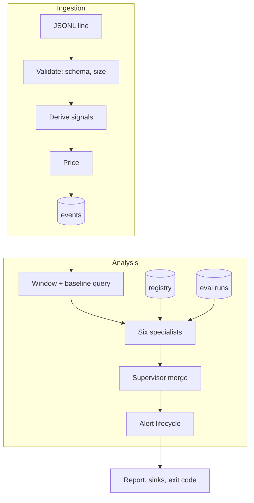

# Architecture

## Problem statement

Operating several LLM applications creates concerns that classic monitoring does not cover together:
spend that scales with prompt size, answers that degrade without errors, injection and data leakage,
silent model and prompt changes, and evaluation results that nobody compares over time. Each concern
tends to get its own tool, so no one sees platform risk as a whole and alerts pile up without an owner.

## Requirements

| # | Requirement | Where it is met |
| - | ----------- | --------------- |
| R1 | One telemetry format for every application | `LLMEvent` and JSON Lines ingestion |
| R2 | Do not retain prompts, responses or user identities | Signals derived at ingestion; text discarded; user ids hashed |
| R3 | Cover availability, cost, security, quality, drift and governance | Six specialist agents |
| R4 | Results must be reproducible and explainable | Deterministic rule-based agents; evidence on every alert |
| R5 | One failing check must not blind the platform | Supervisor isolates agent failures and keeps their alerts |
| R6 | Alerts must be actionable over time | Fingerprints, occurrence counts, acknowledgement, auto-resolution |
| R7 | Only approved models and prompts in production | Registry, lifecycle rules, separation of duties, governance agent |
| R8 | Detect model and prompt regressions | Evaluation runs with case-level comparison |
| R9 | Resilient multi-model calls | Router with fallback and circuit breakers |
| R10 | Testable without live systems | Simulator, in-memory SQLite, mock transports |

## System overview

## Privacy by design

The event schema accepts raw text because that is what applications have, but the stored form
(`StoredEvent`) has no text fields. `to_stored` computes signals and returns a model that cannot hold
text, so there is no code path that writes it. What survives:

| Signal | Use |
| ------ | --- |
| `in_chars`, `out_chars` | Input and output size drift |
| `pii_in`, `pii_out`, `secrets_in`, `secrets_out` | Leakage alerts |
| `injection` (rule names) | Injection rate and repeat offenders |
| `grounding` | Hallucination-risk monitoring |
| `input_hash` | Duplicate-input detection for caching estimates |
| `user_hash` | Repeat-offender detection |

Hashes are HMAC-SHA256 truncated to 16 hex characters, keyed with a configurable secret salt. They
support equality tests without revealing values, but a low-entropy input can be guessed without a
secret salt, so the salt should be set.

## Analysis windows

`report` takes the window (default the last 24 hours) and the baseline (default the six days before it).
Agents receive both lists and the context (SLOs, thresholds, catalog, registry, evaluation history, the
current time). The window is half-open at the start and includes events at the reference time.

## Specialist agents

Each agent implements `analyze(ctx) -> AgentResult(name, alerts, metrics)`.

- **Observability.** Percentiles use linear interpolation over successful requests. Error-budget burn is
  `error_rate / (1 - slo_availability)`. Spikes compare the window with the baseline and require both a
  ratio and an absolute difference so tiny rates do not fire.
- **Cost.** Spend uses the recorded `cost_usd`, or the catalog when absent. Budget alerts need at least
  half a day of data. Spend spikes need a ratio and a dollar floor. Caching savings are the cost of
  repeated inputs. Downshift estimates re-price the same tokens on a cheaper catalog model and are
  labelled as ignoring quality.
- **Security.** Rates are computed per application. Repeat offenders are counted by user hash.
- **Quality.** Grounding is the fraction of output sentences whose content words are mostly present in
  the retrieved context. Evaluation regressions compare the two latest runs of a suite and target.
- **Drift.** PSI uses baseline quantile bins (or below, equal and above bins when the baseline is
  constant, since quantile edges collapse in that case). A numeric feature alerts when PSI passes the
  moderate threshold and the KS test agrees (p below 0.01). Categorical features use PSI on shares.
  Evidence reports shares, not counts, because windows differ in length.
- **Governance.** Production events are checked against the registry. Missing entries and unapproved
  statuses map to severities. Non-production traffic is ignored.

## Supervisor and alert lifecycle

The supervisor runs agents in order. An exception is caught, redacted, recorded on the agent's result and
raised as a high-severity alert. Alerts are deduplicated by fingerprint (agent, application and key), keeping the
most severe. `AlertManager.sync` then:

1. inserts new alerts as open,
2. increments occurrences and updates severity and text for repeats,
3. keeps acknowledged alerts acknowledged,
4. reopens resolved alerts that fire again,
5. resolves open or acknowledged alerts that did not fire, but only for agents that ran successfully.

Point 5 matters: a broken agent produces no alerts, so treating silence as recovery would hide real
problems during exactly the moment monitoring is impaired. New and reopened alerts at high severity or
above are delivered to sinks once.

## Registry and governance

Transitions are validated against explicit tables. Approval requires an actor different from the model's
owner or the prompt's author. Every mutation writes to `audit_log` in the same transaction as the change,
so the trail cannot diverge from state. Prompt content is hashed, never stored, and `verify_prompt` allows
production to prove it runs the approved text.

## Evaluation

Suites are data (YAML). Assertions are deterministic so a regression means behaviour changed, not that a
judge model varied. A provider failure fails the case and is recorded, so an outage shows as a pass-rate
drop rather than a crash. Outputs are stored only as short redacted previews.

## Router

`ModelRouter` orders candidates by strategy, filters by tier and tries them in turn. Each model has a
breaker: consecutive failures open it, a cooldown must pass, then exactly one trial request is allowed
(concurrent callers are refused while it is in flight). Success closes the breaker and updates an
exponentially weighted latency average. Every real attempt is emitted as an `LLMEvent`, so routing
behaviour appears in the same reports as everything else. The clock is injectable for deterministic tests.

## Storage

SQLite with WAL, indices on time and application, and bound parameters throughout. The schema is created
on open. A single process writes; this is appropriate for one operator or a scheduled job.

## Trade-offs

| Decision | Benefit | Cost |
| -------- | ------- | ---- |
| Signals instead of stored text | Strong privacy story; small database | Cannot replay or re-analyse raw conversations |
| Deterministic agents | Reproducible, testable, no data leaves the environment | Cannot find failure modes outside the rules |
| Lexical grounding | Cheap, explainable, offline | Misses subtle misreadings |
| Dual condition for numeric drift (PSI and KS) | Fewer false alarms | May miss small but real shifts |
| Absolute floors on spikes | Quiet at low volume | Small applications may need lower floors |
| SQLite | Zero infrastructure | Single writer; not for shared multi-node use |

## Scalability

Analysis loads a window and a baseline into memory, so cost grows with event volume in those windows.
That is comfortable to hundreds of thousands of events. Beyond that, push aggregation into SQL, sample the
baseline, or move to a columnar store. Ingestion streams in batches of 1,000.

## Extensibility

- **New agent:** implement `SpecialistAgent` and add it to `container.build_service`.
- **New sink:** implement `AlertSink.send`.
- **New assertion:** extend `AssertionType` and `check_assertion`.
- **New signal:** compute it in `signals.derive_signals` and add a field to `Signals`.
